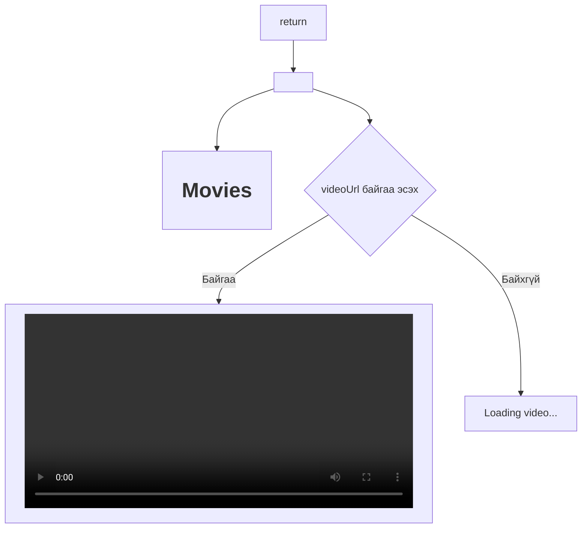

---

## Movies.jsx-ийн return хэсгийн схем

```mermaid
flowchart TD
    A[return] --> B[<div>]
    B --> C[<h1>Movies</h1>]
    B --> D{videoUrl байгаа эсэх}
    D -- Байгаа --> E[<video controls width="600">]
    E --> G[<source src={videoUrl} type="video/mp4" />]
    E --> H[Your browser does not support the video tag.]
    D -- Байхгүй --> F[<p>Loading video...</p>]
```

Энд ternary operator (нөхцөл ? хэрвээ_үнэн_бол_хийх : хэрвээ_худлаа_бол_хийхгүй) ашигласан. Хэрвээ videoUrl байвал видео тоглуулагч харуулна, байхгүй бол "Loading video..." гэж гарна.

---

## useEffect болон ternary операторын схем

```mermaid
flowchart TD
    A[useEffect Hook] --> B{Check if user exists}
    B -- No --> C[return (do nothing)]
    B -- Yes --> D[fetchVideo() async function]
    D --> E[Create reference to file in storage: "movies/Screen Recording 2025-07-13 192952.mp4"]
    E --> F[Try to get download URL from Firebase]
    F -- Error --> G[console.error("Error fetching...")]
    F -- Success --> H[setVideoUrl(url)]
```

Энэ схем нь useEffect доторх логик болон ternary операторын үйл явцыг харуулж байна.

# FireMovie — React Firebase Кино Апп

Энэ төсөл нь React болон Firebase ашиглан хийсэн энгийн кино үзэх вэб апп юм. Хэрэглэгч бүртгүүлэх, нэвтрэх, Firebase Storage-оос видео татаж үзэх боломжтой.

## Ашигласан технологиуд

- React
- Firebase (Authentication, Firestore, Storage)
- React Router

## Суулгах болон ажиллуулах

1. Репозиторийг клондоно:
   ```
   git clone ...
   ```
2. Хэрэгтэй сангуудыг суулгана:
   ```
   npm install
   ```
3. Серверийг ажиллуулна:
   ```
   npm start
   ```
4. Хөтчөөрөө [http://localhost:3000](http://localhost:3000) хаягаар орно.

## Гол бүтэц

- `src/pages/Register.jsx` — Хэрэглэгч бүртгүүлэх хуудас
- `src/pages/Login.jsx` — Хэрэглэгч нэвтрэх хуудас
- `src/pages/Movies.jsx` — Кино үзэх хуудас (Firebase Storage-оос видео татаж үзүүлнэ)
- `src/firebase.js` — Firebase-ийн тохиргоо

## Movies.jsx-ийн useEffect Hook-ийн тайлбар

```mermaid
flowchart TD
    A[useEffect Hook] --> B{Хэрэглэгч байгаа эсэхийг шалгах}
    B -- "Үгүй" --> C[return (юу ч хийхгүй)]
    B -- "Тийм" --> D[fetchVideo() async function]
    D --> E[Storage доторх 'movies/Screen Recording 2025-07-13 192952.mp4' файлын ref үүсгэнэ]
    E --> F[Firebase Storage-оос татах линк авахыг оролдоно]
    F -- "Амжилтгүй" --> G[console.error('Error fetching...')]
    F -- "Амжилттай" --> H[setVideoUrl(url)]
```

## return хэсгийн тайлбар



## Тухайн хэсгийн кодын тайлбар

```jsx
{
  videoUrl ? (
    <video controls width="600">
      <source src={videoUrl} type="video/mp4" />
      Your browser does not support the video tag.
    </video>
  ) : (
    <p>Loading video...</p>
  );
}
```

Энд ternary operator (нөхцөл ? хэрвээ*үнэн*бол*хийх : хэрвээ*худлаа*бол*хийхгүй) ашигласан. Хэрвээ videoUrl байвал видео тоглуулагч харуулна, байхгүй бол "Loading video..." гэж гарна.

## useEffect Hook гэж юу вэ?

`useEffect` нь React-ийн hook бөгөөд компонент render болох үед болон тодорхой хувьсагч өөрчлөгдөхөд код ажиллуулах боломж олгодог. Энэ төсөлд:

- Хэрэглэгч нэвтэрсэн эсэхийг шалгана
- Нэвтэрсэн бол Firebase Storage-оос видео татахыг оролдоно
- Амжилттай бол татсан URL-ийг state-д хадгална
- Алдаа гарвал консолд бичнэ

## Firebase тохиргоо

### Firebase үүсгэх болон React апптай холбох алхамууд

1. **Firebase-д бүртгүүлэх, төсөл үүсгэх**

   - [https://console.firebase.google.com/](https://console.firebase.google.com/) руу орж Google account-аараа нэвтэрнэ.
   - "Add project" дээр дарж шинэ төсөл үүсгэнэ. Төслийн нэрээ өгөөд "Continue".
   - Google Analytics хэрэглэх эсэхээ сонгоод "Create project".

2. **Вэб апп нэмэх**

   - Төслийнхөө гол хуудаснаас "</>" (Web) икон дээр дарж "Register app".
   - App nickname өгөөд "Register app".
   - "Firebase SDK snippet" хэсэгт гарч ирэх config объект (apiKey, authDomain гэх мэт)-ыг хуулж авна.

3. **Firebase сангуудыг суулгах**

   - Терминал дээр дараах командыг ажиллуулна:
     ```
     npm install firebase
     ```

4. **Firebase-ийг React аппдаа холбох**

   - `src/firebase.js` файл үүсгээд дараах кодыг оруулна:

     ```js
     import { initializeApp } from "firebase/app";
     import { getFirestore } from "firebase/firestore";
     import { getAuth } from "firebase/auth";
     import { getStorage } from "firebase/storage";

     const firebaseConfig = {
       apiKey: "...",
       authDomain: "...",
       projectId: "...",
       storageBucket: "...",
       messagingSenderId: "...",
       appId: "...",
     };

     const app = initializeApp(firebaseConfig);
     export const db = getFirestore(app);
     export const auth = getAuth(app);
     export const storage = getStorage(app);
     ```

   - Энд "..." хэсгүүдийг Firebase консол дээрээс авсан өөрийн config утгаар солино.

5. **Authentication тохируулах**

   - Firebase Console > Authentication > Get started.
   - "Email/Password" sign-in method-ийг "Enable" болгоно.

6. **Firestore болон Storage идэвхжүүлэх**

   - Firestore: Firebase Console > Firestore Database > Create database > Start in test mode (эсвэл security тохируулж болно).
   - Storage: Firebase Console > Storage > Get started > Next > Done.

7. **React аппдаа ашиглах**
   - `auth`, `db`, `storage`-ийг import хийж хэрэглэнэ:
     ```js
     import { auth, db, storage } from "./firebase";
     ```

Эдгээр алхмуудыг дагаснаар та Firebase-ээ React апптай бүрэн холбож, authentication, firestore, storage-ийг ашиглах боломжтой болно.

## Хэрэглэгчийн бүртгэл, нэвтрэлт

- Register болон Login хуудсууд нь Firebase Authentication ашиглан хэрэглэгч бүртгэх, нэвтрэх боломжтой.

## Лиценз

MIT

---

## useEffect Hook-ийн дэлгэрэнгүй тайлбар

**useEffect** нь React-ийн хамгийн чухал hook-уудын нэг бөгөөд компонент render болох, эсвэл тодорхой хувьсагч өөрчлөгдөх бүрт ямар нэгэн код автоматаар ажиллуулах боломж олгодог.

Жишээ:

```js
import React, { useEffect, useState } from "react";

function Example() {
  const [count, setCount] = useState(0);

  useEffect(() => {
    // Энэ хэсэгт бичсэн код бүр component render болох бүрт ажиллана
    console.log("count-ийн утга:", count);
  }, [count]); // count өөрчлөгдөх бүрт ажиллана

  return <button onClick={() => setCount(count + 1)}>Нэмэх</button>;
}
```

**Movies.jsx**-д хэрхэн ашигласан:

- Хэрэглэгч нэвтэрсэн эсэхийг шалгана
- Нэвтэрсэн бол Firebase Storage-оос видео татаж авна
- Амжилттай бол татсан URL-ийг state-д хадгална
- Алдаа гарвал консолд бичнэ

---

## Тernary оператор (гурвалсан оператор) гэж юу вэ?

Тernary оператор нь нөхцөл шалгах богино хэлбэр бөгөөд дараах бүтэцтэй:

```
нөхцөл ? хэрвээ_үнэн_бол_хийх : хэрвээ_худлаа_бол_хийхгүй;
```

Жишээ:

```js
const isLoggedIn = true;
const message = isLoggedIn ? "Тавтай морилно уу!" : "Нэвтэрнэ үү.";
console.log(message); // Тавтай морилно уу!
```

**Movies.jsx**-д хэрхэн ашигласан:

```jsx
{
  videoUrl ? (
    <video controls width="600">
      <source src={videoUrl} type="video/mp4" />
      Your browser does not support the video tag.
    </video>
  ) : (
    <p>Loading video...</p>
  );
}
```

Энд videoUrl байгаа эсэхийг шалгаад, байвал видео тоглуулагч харуулна, байхгүй бол "Loading video..." гэж гаргана.

This section has moved here: [https://facebook.github.io/create-react-app/docs/advanced-configuration](https://facebook.github.io/create-react-app/docs/advanced-configuration)

### Deployment

This section has moved here: [https://facebook.github.io/create-react-app/docs/deployment](https://facebook.github.io/create-react-app/docs/deployment)

### `npm run build` fails to minify

This section has moved here: [https://facebook.github.io/create-react-app/docs/troubleshooting#npm-run-build-fails-to-minify](https://facebook.github.io/create-react-app/docs/troubleshooting#npm-run-build-fails-to-minify)
